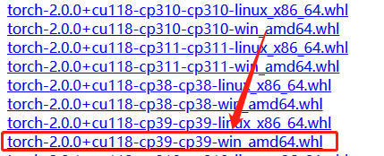
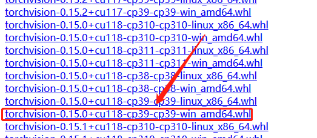
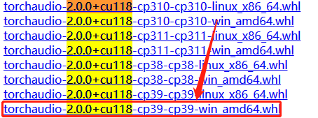
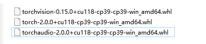
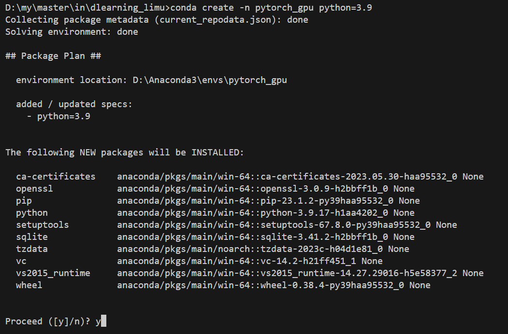

# 在anaconda下安装pytorch
<<<<<<< HEAD
<!-- TOC -->

- [在anaconda下安装pytorch](#在anaconda下安装pytorch)
    - [cuda的安装](#cuda的安装)
    - [cudnn安装](#cudnn安装)
        - [cuDNN安装到CUDA](#cudnn安装到cuda)
        - [配置环境变量](#配置环境变量)
        - [配置环境变量](#配置环境变量)
    - [3. gpu版本的pytorch安装](#3-gpu版本的pytorch安装)
        - [选择安装版本](#选择安装版本)
        - [下载](#下载)
    - [4. conda虚拟环境下安装pytorch](#4-conda虚拟环境下安装pytorch)

<!-- /TOC -->
## cuda的安装 
&emsp;1\) 下载cuda
<br>&emsp;下载CUDA之前，首先要确定计算机GPU所支持的CUDA版本。打开cmd输入如下命令：
````shell
nvidia-smi
````

可以看出GPU最高支持安装到12.0版本的CUDA,因此必需安装小于等于这个版本的CUDA。  
需要注意的是，CUDA支持的算力和GPU算力之间应该满足一定的匹配关系，否则安装之后会出现版本冲突问题。  
GPU的算力可以在这里查看：
<https://developer.nvidia.com/cuda-gpus>  我的显卡是3050ti对应的算力是
8.6（不太清楚这个算力是个什么量化指标）  
<https://docs.nvidia.com/cuda/ampere-compatibility-guide>这个网址给出了CUDA可以支持的算力和GPU算力的匹配规则  
  
翻译一下是什么意思呢，就是说GPU的算力要比CUDA支持的算力高，比如最高支持7.0算力的CUDA可以在算力为7.5的GPU上面运行。但是GPU的算力不能超过CUDA支持的算力太多，比如8.x的GPU就只能安装支持8.0—8.x算力的CUDA，但是不能安装7.x的CUDA。3050ti的算力是8.6,这里我选的是11.8版本的CUDA.
<center class="half">


</center>  
&emsp;2) 安装cuda
下载完成后安装即可。安装选择自定义安装，只勾选CUDA，安装位置默认即可。  

  

  

&emsp;3) test
在cmd里输入如下命令：  
```shell
    nvcc -V
```
会显示如下信息：  
  
如果没有出现的话，可以检查一下有没有安装成功，再检查一下有没有添加环境变量，一般会默认添加好环境变量。  
安装完毕。

## cudnn安装
### cuDNN安装到CUDA
cuDNN的下载地址： <https://developer.nvidia.com/rdp/cudnn-download>  
下载对应CUDAv版本的cuDNN,需要先注册一下，如果下载很慢可以切热点下载试试。

  
将下载的cuDNN压缩包解压，得到如下的文件夹：  
  
将三个文件夹中所有的文件复制到<u>**CUDA的安装目录下的同名文件夹下**</u>，注意不是替换文件夹，而是把文件夹对应进行合并！！！！！  
如果是默认路径安装的CUDA的话，CUDA的安装目录为:
``````
C:\Program Files\NVIDIA GPU Computing Toolkit\CUDA\v11.8
``````
### 配置环境变量
将以下的四个路径添加到系统变量的path中，如果没有修改CUDA的安装位置，则直接复制到path即可，如果自定义的CUDA的安装路径，则把\bin,\include,\lib,\libnvvp四个文件夹对应的路径添加到系统变量的path中。CUDA安装时一般会自动将其中两个添加到环境变量中，补齐四个即可。

````shell
C:\Program Files\NVIDIA GPU Computing Toolkit\CUDA\v10.2\bin
C:\Program Files\NVIDIA GPU Computing Toolkit\CUDA\v10.2\include
C:\Program Files\NVIDIA GPU Computing Toolkit\CUDA\v10.2\lib
C:\Program Files\NVIDIA GPU Computing Toolkit\CUDA\v10.2\libnvvp
````  
系统变量位置：win+r,输入如下命令：  
```shell
sysdm.cpl
```


endendend

## 3.gpu版本的pytorch安装
### 选择安装版本
首先要去官网<https://pytorch.org/get-started/previous-versions/>  
查找cuda，torch和torchvision的版本对应关系，我安装的是11.8的CUDA，对应的是2.0版本的torch和0.15版本的torchvision。

### 下载
下载网址：<https://download.pytorch.org/whl/cu102>
找到对应版本的torch,"cu"指示CUDA版本，"cp"指示对应的python版本。注意有"**cu**"的才是GPU版本的torch！！！！！  


  

下载完毕！  
  
这里可以预先将三个文件放在一个文件夹里面,方便后续加载

## 4.conda虚拟环境下安装pytorch
首先创建虚拟环境，python版本的选择要和上述下载的torch对应的python版本一致。在cmd里运行如下的命令创建环境：
``````shell
conda create -n pytorch_gpu python=3.9
``````
 "pytorch_gpu"为虚拟环境名称，我选择的python版本为3.9，自行修改。
   

激活进入虚拟环境
``````shell
conda activate pytorch_gpu
``````  

加载刚刚下载的python压缩包，即wheel文件。
``````shell
pip install + 对应三个包的路径
``````  
我的包的路径为D:\pytorch，因此执行如下命令：
``````shell
pip install D:\\pytorch\\torch-2.0.0+cu118-cp39-cp39-win_amd64.whl
pip install D:\\pytorch\\torchvision-0.15.0+cu118-cp39-cp39-win_amd64.whl
pip install D:\\pytorch\\torchaudio-2.0.0+cu118-cp39-cp39-win_amd64.whl
``````  
end！end！end！(撒花)小白一个，多有借鉴，如有不足，请多指教。
=======
## <a name='cuda'></a>1.cuda的安装和环境变量配置  
&emsp;1\) 下载cuda
<br>&emsp;下载CUDA之前，首先要确定计算机GPU所支持的CUDA版本。打开cmd输入如下命令：
````
nvidia-smi
````

可以看出GPU最高支持安装到
>>>>>>> a536f29d9bad71957dbbe3c84f65c73674a3015a
