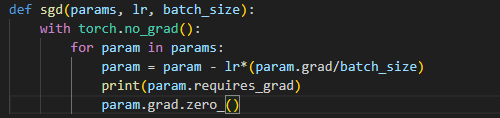
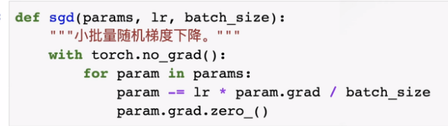
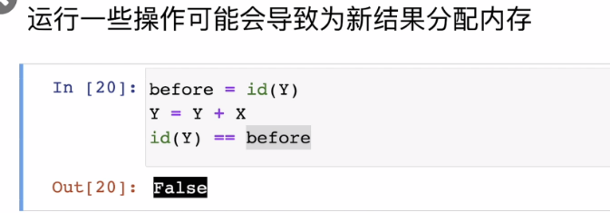

#  pytorch报错：'NoneType' object has no attribute 'zero_'
看李沐的动手学深度学习pytorch版时复现线性回归代码时报错：'NoneType' object has no attribute 'zero_'  
    
  
找到报错对应位置，下面是我复现时的写法：  
  
  
视频给出的写法：  
   
  
区别在于我没有使用"-="运算符，这里回忆沐神在数据操作这一章讲到的原地操作：
  
因此报错原因是："-="是一个原地操作，是将新的值直接覆盖在原变量上，因此在"torch.no_grad()"下，不会将tensor的require_gard从True变为False，但是赋值运算符"="执行的不是原地操作，而是在新的地址创建了一个新的变量，因此在"torch.no_grad()"会导致require_gard变为False。  
endendend