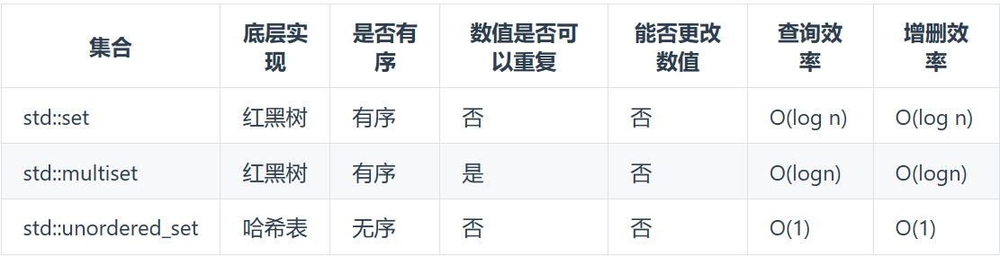

## 基本语法
### 哈希表
常见的三种哈希表的实现方式：数组，set，map
* 数组
* set

* map

### set
* 迭代器
| 功能 | 描述 |
| --- | --- |
| begin() | 返回指向 set 开始的迭代器 |
| cbegin() | 返回指向 set 开始的 const 迭代器 |
| end() | 返回指向 set 结尾的迭代器 |
| cend() | 返回指向 set 结尾的 const 迭代器 |
| rbegin() | 返回指向 set 结尾的逆向迭代器 |    
| Rend() | 返回指向 set 开始的逆向迭代器 |
| crbegin() | 返回指向 set 结尾的逆向 const 迭代器 |
| crend() | 返回指向 set 开始的逆向 const 迭代器 |
* 容量
| 功能 | 描述 |
| --- | --- |
| size() | 返回容器中元素的数目 |
| max_size() | 返回容器能容纳的元素的最大数目 |
| empty() | 判断容器是否为空 |
* 修改器
| 功能 | 描述 |
| --- | --- |
| insert() | 在 set 容器中插入元素 |
| erase() | 删除 set 容器中的元素 |
| swap() | 交换两个 set 容器 |
| clear() | 清除 set 容器中的所有元素 |
| emplace() | 在 set 容器中插入元素 |
| emplace_hint() | 在 set 容器中插入元素 |
* 查找
| 功能 | 描述 |
| --- | --- |
| count() | 返回指定元素出现的次数 |
| find() | 查找指定元素 |
| lower_bound() | 返回指向大于（或等于）某值的第一个元素的迭代器 |
| upper_bound() | 返回指向大于某值的第一个元素的迭代器 |
| equal_range() | 返回与指定值相等的上下限的两个迭代器 |