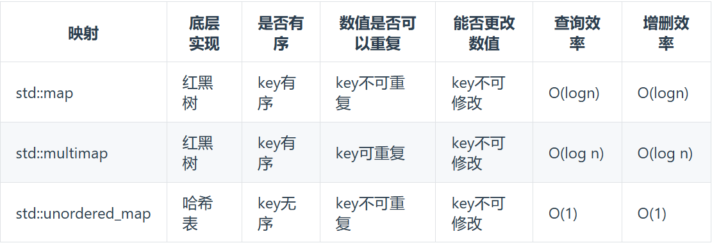

[TOC]

### 哈希表
常见的三种哈希表的实现方式：数组，set，map
* 数组
* set

* map
  

### 对函数名取地址(对函数名的理解)
举下面的例子：
```c++
int add(){
   return 1;
}
int main(){
   // 输出函数add的地址
   cout << add << endl;
   // 对add取地址
   cout << &add << endl;
   // 对函数名取内容
   cout << *add << endl;
   // 结果是一样的地址，但是返回类型不同
   cout << typeid(add).name() << endl;
   cout << typeid(&add).name() << endl;
   cout << typeid(*add).name() << endl;
}
```  
只有中间那个的类型是函数指针，其他两个都不是。

func得到函数地址，是因为它是**函数指示符**。**只有在作为sizeof或者单目运算符&取地址时候，它的类型才是函数;其它情况都会被转化为指向该函数的指针**。所以&func和func都会得到函数的地址,*func时候返回函数地址则是一种默认规定。

### 迭代器
* 迭代器  

| 功能 | 描述 |
| --- | --- |
| begin() | 返回指向 set 开始的迭代器 |
| cbegin() | 返回指向 set 开始的 const 迭代器 |
| end() | 返回指向 set 结尾的迭代器 |
| cend() | 返回指向 set 结尾的 const 迭代器 |
| rbegin() | 返回指向 set 结尾的逆向迭代器 |    
| Rend() | 返回指向 set 开始的逆向迭代器 |
| crbegin() | 返回指向 set 结尾的逆向 const 迭代器 |
| crend() | 返回指向 set 开始的逆向 const 迭代器 |  

* 容量  

| 功能 | 描述 |
| --- | --- | 
| size() | 返回容器中元素的数目 |
| max_size() | 返回容器能容纳的元素的最大数目 |
| empty() | 判断容器是否为空 |  

* 修改器  

| 功能 | 描述 |
| --- | --- |
| insert() | 在 set 容器中插入元素 |
| erase() | 删除 set 容器中的元素 |
| swap() | 交换两个 set 容器 |
| clear() | 清除 set 容器中的所有元素 |
| emplace() | 在 set 容器中插入元素 |
| emplace_hint() | 在 set 容器中插入元素 | 

* 查找  

| 功能 | 描述 |
| --- | --- |
| count() | 返回指定元素出现的次数 |
| find() | 查找指定元素 |
| lower_bound() | 返回指向大于（或等于）某值的第一个元素的迭代器 |
| upper_bound() | 返回指向大于某值的第一个元素的迭代器 |
| equal_range() | 返回与指定值相等的上下限的两个迭代器 |

* 迭代器的分类和支持的操作  

| 类型 | 描述 |支持的遍历操作| 使用该类型的容器 |
| --- | --- | --- | ---|
| 输入迭代器 | 提供对数据的只读访问 | ++, ==, != |  |
| 输出迭代器 | 提供对数据的只写访问 | ++, ==, != |  |
| 前向迭代器 | 可以读写数据 | ++, ==, != | list, slist, set, multiset, map, multimap |
| 双向迭代器 | 可以双向读写数据 | ++, --, ==, != | list, slist, set, multiset, map, multimap |
| 随机访问迭代器 | 可以以随机访问的方式读写数据 | ++, --, ==, !=, >, <, >=, <=, +n, -n | vector, deque, string, array |

### String
* string中length()和size()和sizeof()的区别  
length()和size()是string类的成员函数，返回string的长度，sizeof()是C++的一个操作符，返回对象或类型的大小。

* string和int之间的转换
int转string：   

|序号|方法|描述|
|---|---|---|
|1|to_string()函数|C++11标准引入的函数|
|2|stringstream类|C++标准库中的类|
|3|sprintf()函数|C标准库中的函数|
|4|int stoi(const string& str, size_t* pos = 0, int base = 10)|size_t 是一个无符号整数类型，typedef unsigned int size_t;, base是进制|
|5|long stol(const string& str, size_t* pos = 0, int base = 10)||
|6|long long stoll(const string& str, size_t* pos = 0, int base = 10)||
|7|unsigned long stoul(const string& str, size_t* pos = 0, int base = 10)||
|8|unsigned long long stoull(const string& str, size_t* pos = 0, int base = 10)||
|9|float stof(const string& str, size_t* pos = 0)||
|10|double stod(const string& str, size_t* pos = 0)||
|11|long double stold(const string& str, size_t* pos = 0)||
|12|double stod(const string& str, size_t* pos = 0)||
*4-12都包含在string头文件中*
```c++
int a = 123;
// 1. to_string()函数
string str = to_string(a);
// 2. stringstream类
ostringstream oss;
oss << a;
string str = oss.str();
// 3. sprintf()函数
char buf[100];
sprintf(buf, "%d", a);
string str = buf;
```
string转int：
1. istream类: istringstream
2. scanf()函数
3. atoi()函数
```c++
string str = "123";
// 1. istream类: istringstream
int a;
istringstream iss(str);
iss >> a;
// 2. scanf()函数
int a;
sscanf(str.c_str(), "%d", &a);
// 3. atoi()函数
int a = atoi(str.c_str());
```

### reverse
reverse()函数是C++标准库中的函数，用于反转字符串和数组以及容器中的元素。输入参数是两个迭代器，分别指向要反转的元素的起始位置和结束位置。reverse()函数会将这两个迭代器之间的元素反转。

### queue
queue提供的操作有：
* push()：在队尾插入一个元素
* pop()：在队头删除一个元素
* front()：返回队头元素
* back()：返回队尾元素
* empty()：判断队列是否为空
* size()：返回队列中元素的个数

queue库提供的类：
1. queue：普通队列
2. priority_queue：优先队列
   定义方法：priority_queue<元素类型> 变量名;

#### priority_queue
priority_queue包括在头文件<queue>中，定义方法：
```c++
priority_queue<type, container, compare> name;
```  
其中，type是元素类型，container是容器类型，compare是比较类型。最简单的定义方式为：
`priority_queue<int> q;`，后两个参数默认为vector和less，即默认是大顶堆。如果第三个参数为greater，则是小顶堆。  
```c++
priority_queue<int, vector<int>, less<int>> q;//大顶堆
priority_queue<int, vector<int>, greater<int>> q;//小顶堆
```
* **自定义比较函数**
**比较函数的作用是用来判断第一个参数的优先级是否低于第二个参数。**
通过运算符重载来自定义比较函数，可以见leetcode第347题的解法。自定义比较函数有以下方法：
1. struct重载()运算符
```c++
struct cmp{
    bool operator()(int a, int b){
        return a > b;
    }
};
```
2. class重载()运算符
```c++
class cmp{
public:
    bool operator()(int a, int b){
        return a > b;
    }
};
```
3. 自定义函数

decltype()函数：decltype是C++11标准引入的关键字，用于获取变量的类型。在定义函数指针时，如果函数的返回值类型是auto，那么编译器无法推断函数指针的类型。  
decltype()函数和auto的区别：
* auto根据=右边的初始值推导出变量的类型，decltype根据exp表达式推导出变量的类型，跟=右边的value没有关系
* auto要求变量必须初始化，这是因为auto根据变量的初始值来推导变量类型的，如果不初始化，变量的类型也就无法推导，而decltype不要求。

这种情况下，需要decltype()函数，用于获取函数指针的类型。
```c++
bool cmp(int a, int b){
    return a > b;
}
priority_queue<int, vector<int>, decltype(&cmp)> q(cmp);
```

4. lambda表达式
```c++
auto cmp=[](vector<int>&a,vector<int>&b)->bool{
            return a[0]>b[0];
        };
priority_queue<vector<int>,vector<vector<int>>,decltype(cmp)> q(cmp);//小顶堆
```


### vector
* vector< 变量类型 > 变量名; //声明一个vector
| 方法 | 描述 | 备注 |
| --- | --- | --- |
| push_back() | 在vector的末尾添加一个元素 |    |
| pop_back() | 删除vector的最后一个元素 |   |
| std::find(v.begin(), v.end(), key)| 在vector中查找指定元素 | 注意这个和map、set的find方法不一样 |
| v.erase(v.begin() + i) | 删除vector中的第i个元素 |   |

### map、set
* map< key类型, value类型 > 变量名; //声明一个map
map提供的操作有：  

| 方法 | 描述 | 备注 |
| --- | --- | --- |
| void insert(pair<key类型, value类型>(key, value)) | 在map中插入元素 |   |
| map.find(key) | 在map中查找指定元素 | 返回一个迭代器 |
| map.erase(key) | 删除map中的指定元素 |   |
| map.erase(map.begin(), map.end()) | 删除map中的所有元素 |   |
| map.clear() | 删除map中的所有元素 |   |
| map.size() | 返回map中元素的个数 |   |
| map.empty() | 判断map是否为空 |   |  

* map排序

### tree
#### 二叉树的种类
1. 满二叉树：一个二叉树，如果每一个层的结点数都达到最大值，则这个二叉树就是满二叉树。
2. 完全二叉树：对于一颗具有n个结点的二叉树按层序编号，如果编号为i的结点与同样深度的满二叉树中编号为i的结点在二叉树中位置完全相同，则这颗二叉树称为完全二叉树。
3. 二叉搜索树：左子树上所有结点的值均小于它的根结点的值，右子树上所有结点的值均大于它的根结点的值。or  完全二叉树中，除了最底层节点可能没填满外，其余每层节点数都达到最大值，并且最下面一层的节点都集中在该层最左边的若干位置。
4. 二叉搜索树：左子树上所有结点的值均小于它的根结点的值，右子树上所有结点的值均大于它的根结点的值。
5. 平衡二叉搜索树：是一种特殊的二叉搜索树，它或者是一棵空树，或者是具有以下性质的二叉树：它的左子树和右子树都是平衡二叉树，且左子树和右子树的深度之差的绝对值不超过1。

#### 二叉树的定义
```c++
struct TreeNode{
    int val;
    TreeNode *left;
    TreeNode *right;
    // 构造函数
    TreeNode(int x): val(x), left(NULL), right(Null){};
}
```

### stack
1. stack的初始化
```c++

//1、创建一个空的栈s1
stack<int> s1;
stack<int,list<int>> s1;
 
//2、用vector容器初始化stack
vector<int> v1={1,2,3,4};
stack<int,vector<int>> s2(v1);   //1,2,3,4依次入栈
 
//3、用deque容器初始化stack
//用deque为stack初始化时deque可省  因为stack是基于deque实现的, 默认以deque方式构造
deque<int> d1 = {1,2,3,4,5};
stack<int,deque<int>> s3(d1);
stack<int> s4(d1);  
 
//4、用list容器初始化stack
list<int> l1 = {1,2,3,4,5};
stack<int,list<int>> s5(l1)
```

### accumulate函数
accumulate函数是C++标准库中的函数，用于计算区间内元素的累加值。accumulate函数的定义如下：
```c++
accumulate(first, last, init);
```
其中，first和last是迭代器，init是初始值。accumulate函数的作用是计算[first, last)区间内元素的累加值，初始值为init。accumulate函数的返回值是累加值。
