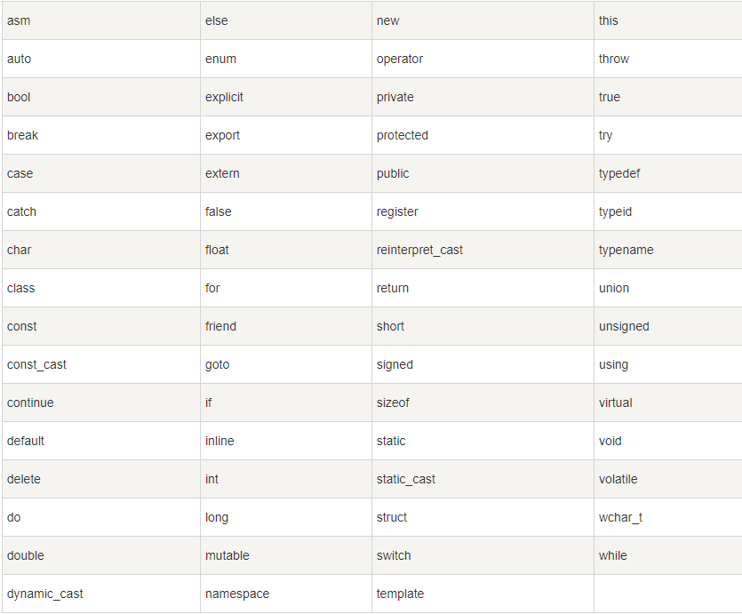
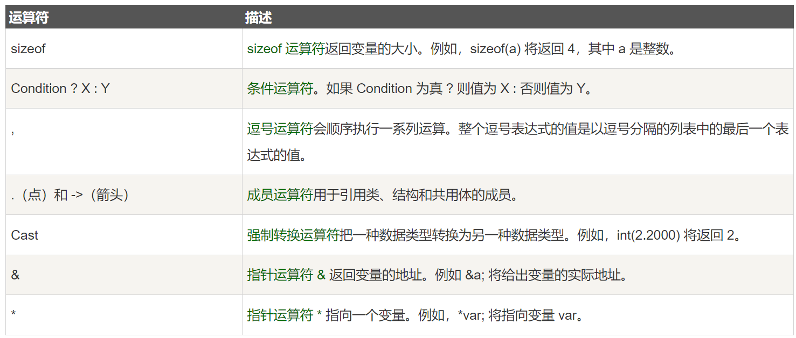

[TOC]

## 资料

- c++ 学习路线 [https://codefather.cn](https://codefather.cn)

## 基本语法

### 关键字



### 三字字符

C++ 标准允许把某些字符指定为三字符序列，以前为了表示键盘上没有的字符

### 注释

- 单行注释 //
- 多行注释 /* */

```cpp
#include <iostream>
using namespace std;
/* 这是一个多行注释
   这是一个多行注释
   这是一个多行注释 */
// 这是一个单行注释
```

### 数据类型

#### 七种基本数据类型

| 类型                                                                 | 描述    |
| -------------------------------------------------------------------- | ------- |
| 布尔型                                                               | bool    |
| 字符型                                                               | char    |
| 整型                                                                 | int     |
| 浮点型                                                               | float   |
| 双浮点型                                                             | double  |
| 无类型                                                               | void    |
| 宽字符型                                                             | wchar_t |
| wchar_t 实际上是 short int 类型，占用 2 个字节，用来存储一个宽字符。 |         |

#### 四种修饰符类型

- signed：有符号数
- unsigned：无符号数
- short：短整数
- long：长整数

_一个字节等于 8 位_

_int，short，long 默认带 signed_

#### 占用字节和取值范围

| 类型               | 占用字节 | 取值范围                                          |
| ------------------ | -------- | ------------------------------------------------- |
| char               | 1        | -2^7 ~ 2^7-1 即-128 ~ 127 或 0 ~ 2^8-1 即 0 ~ 255 |
| unsigned char      | 1        | 0 ~ 2^8-1 即 0 ~ 255                              |
| signed char        | 1        | -2^7 ~ 2^7-1 即-128 ~ 127                         |
| (signed) int       | 4        | -2^31 ~ 2^31-1 即-2147483648 ~ 2147483647         |
| unsigned int       | 4        | 0 ~ 2^32-1 即 0 ~ 4294967295                      |
| (signed) short int | 2        | -2^15 ~ 2^15-1 即-32768 ~ 32767                   |
| unsigned short int | 2        | 0 ~ 2^16-1 即 0 ~ 65535                           |
| (signed) long int  | 4        | -2^31 ~ 2^31-1 即-2147483648 ~ 2147483647         |
| unsigned long int  | 4        | 0 ~ 2^32-1 即 0 ~ 4294967295                      |
| float              | 4        | 3.4E-38 ~ 3.4E+38                                 |
| double             | 8        | 1.7E-308 ~ 1.7E+308                               |
| long long          | 8        | -2^63 ~ 2^63-1                                    |
| long double        | 16       | 3.4E-4932 ~ 1.1E+4932                             |
| wchar_t            | 2        | 0 ~ 65535                                         |

### typedef

typedef 是 C++ 中的一个关键字，它可以为一个已有的类型取一个新的名字。

```cpp
typedef int feet;
feet distance;
```

### 枚举

枚举是一种用户自定义的数据类型，它是由一系列相关的值组成的一个列表。

**枚举的值默认为整型，从 0 开始，依次加 1。如果某个枚举值被赋值，其后的枚举值依次加 1。**

enum 枚举名{

```
 标识符[=整型常数],

 标识符[=整型常数], 
```

...

```
标识符[=整型常数]
```

} 枚举变量;

枚举举例如下：

```cpp
// 定义两种枚举
// 第二种枚举是限定作用域的枚举，可以解决枚举值重名的问题
        enum class color_inner
        {
                RED,
                GREEN,
                BLUE
        };
 
        enum color_out
        {
                RED,
                GREEN,
                BLUE
        };
 
//声明并赋值
color_out backColor = RED; //正确
color_inner forntColor = RED; //错误，默认使用了out中的RED，没有指定作用域
 
color_out backColor = color_out::RED; //正确，out也可以显示指定作用域
color_inner forntColor = color_inner::RED;  //正确，inner必须指定作用域
```

### 类型转换

c++ 中的类型转换有四种：

- static_cast：静态类型转换，用于非多态类型的转换，**如基本数据类型之间的转换**，父类指针转换为子类指针等。
- dynamic_cast：动态类型转换，用于多态类型的转换。动态转换通常用于将一个基类指针或引用转换为派生类指针或引用。
- const_cast：用于去除类型的 const、volatile 和__unaligned 特性。
- reinterpret_cast：重新解释类型，如将指针转换为整数，整数转换为指针等。

### extern 关键字

```cpp
#include <iostream>
using namespace std;
 
// 变量声明
extern int a, b;
extern int c;
extern float f;
  
int main ()
{
  // 变量定义
  int a, b;
  int c;
  float f;
  // 实际初始化
  a = 10;
  b = 20;
  c = a + b;
  cout << c << endl ;
  f = 70.0/3.0;
  cout << f << endl ;
  return 0;
}
```

### 左值和右值

左值：指向内存位置的表达式，可以出现在赋值号的左边或右边。

右值：存储在内存中某个地址的数值，不能对右值进行赋值。

### 变量作用域

变量的作用域可以分为以下几种：

- 局部作用域：在函数内部声明的变量具有局部作用域，即只能在函数内部使用。
- 全局作用域：在所有函数和代码块之外声明的变量具有全局作用域，它们可以被程序中的任何函数访问。全局变量在程序开始时被创建，在程序结束时被销毁。
- 类作用域：类内部声明的变量具有类作用域，它们可以被类的所有成员函数访问。类作用域变量的生命周期与类的生命周期相同。
- 块作用域：在代码块内部声明的变量具有块作用域，它们只能在代码块内部访问。块作用域变量在代码块每次被执行时被创建，在代码块执行完后被销毁。

_在函数内部定义的变量为局部变量，在所有函数和代码块之外定义的变量为全局变量，在函数参数中声明的变量为形式参数。_

### 常量

常量是固定值，在程序执行期间不会改变。这些固定的值，又叫做**字面量**。常量的值在定义后不能进行修改。

#### 整数常量

整数常量可以是十进制、八进制或十六进制的常量。前缀指定基数：0x 或 0X 表示十六进制，0 表示八进制，不带前缀则默认表示十进制。

**后缀**是一个可选的后缀，它可以是 U 和 L 的组合，U 表示无符号整数（unsigned），L 表示长整数（long）。可以大写也可以小写。

#### 浮点常量

#### 布尔常量

True 和 False

#### 字符常量

字符常量包括普通的字符，转义序列和通用字符。**字符常量必须是用单引号括起来的单个字符。**

字符常量是括在单引号中，例如，'x' 可以存储在 char 类型的简单变量中。如果常量以 L（仅当大写时）开头，则表示它是一个宽字符常量（例如 L'x'），此时它必须存储在 wchar_t 类型的简单变量中。

#### 字符串常量

一个字符串包含类似于字符常量的字符：普通的字符、转义序列和通用的字符。

#### 定义常量

两种方式：注意定义常量一般使用大写字母，且一定要初始化。

- 使用 #define 预处理器
- 使用 const 关键字

### 修饰符

放在变量之前，用于表示变量的类型，如 signed，unsigned，long，short 等。

#### 类型限定符

| 限定符   | 含义                                                       |
| -------- | ---------------------------------------------------------- |
| const    | 定义常量，表示该变量的值不能被改变                         |
| volatile | 该变量的值可能会被程序以外的因素改变，如硬件或其他线程     |
| restrict | 表示该指针是访问对象的唯一且初始的方式                     |
| mutable  | 修饰类的成员变量，表示该变量可以在 const 函数中被修改      |
| static   | 用于定义静态变量，表示该变量在程序运行期间一直存在         |
| register | 用于定义寄存器变量，表示该变量存储在寄存器中，而不是内存中 |

```cpp
const int NUM = 10; // 定义常量 NUM，其值不可修改
const int* ptr = &NUM; // 定义指向常量的指针，指针所指的值不可修改
int const* ptr2 = &NUM; // 和上面一行等价

// mutable
class Example {
public:
    int get_value() const {
        return value_; // const 关键字表示该成员函数不会修改对象中的数据成员
    }
    void set_value(int value) const {
        value_ = value; // mutable 关键字允许在 const 成员函数中修改成员变量
    }
private:
    mutable int value_;
};

// static
void example_function() {
    static int count = 0; // static 关键字使变量 count 存储在程序生命周期内都存在
    count++;
}
// register
void example_function(register int num) {
    // register 关键字建议编译器将变量 num 存储在寄存器中
    // 以提高程序执行速度
    // 但是实际上是否会存储在寄存器中由编译器决定
}
```

### c++ 存储类

存储类定义 C++ 程序中变量/函数的范围（可见性）和生命周期。这些说明符放置在它们所修饰的类型之前。下面列出 C++ 程序中可用的存储类：

- `auto`

c++11 之后，auto 关键字用于声明变量，通常用于声明变量的类型会由编译器自动推断。

- `register` 用于定义存储在寄存器中而不是 RAM 中的局部变量
- `static` 编译器在程序的生命周期内保持局部变量的存在，而不需要在每次它进入和离开作用域时进行创建和销毁。
- `extern` 用于提供一个全局变量的引用，全局变量对所有的程序文件都是可见的。
- `mutable`
- `thread_local`: c++11 新增，用于声明线程局部存储变量

### 运算符

1. 算术运算符
2. 关系运算符
3. 逻辑运算符
4. 位运算符
5. 赋值运算符：=, +=, -=, *=, /=, %=, <<=, >>=, &=, ^=, |=
6. 杂项运算符



### 循环

- while 循环
- for 循环
- do...while 循环

### 判断

| 语句           | 描述                                                                                                                                    |
| -------------- | --------------------------------------------------------------------------------------------------------------------------------------- |
| if 语句        | ---                                                                                                                                     |
| if...else 语句 | ---                                                                                                                                     |
| switch 语句    | ---                                                                                                                                     |
| 条件运算符     | Exp1 ? Exp2 : Exp3;如果 Exp1 为真，则计算 Exp2 的值，结果即为整个表达式的值；如果 Exp1 为假，则计算 Exp3 的值，结果即为整个表达式的值。 |

### 函数

函数的定义形式如下：

```cpp
return_type function_name( parameter list )
{
   body of the function
}
```

函数声明：函数声明会告诉编译器函数名称及如何调用函数。函数的实际主体可以单独定义。

```cpp
return_type function_name( parameter list );
```

#### 函数参数

当调用函数时，有三种向函数传递参数的方式：

- 传值调用

把参数的实际值赋值给函数的形式参数。在这种情况下，修改函数内的形式参数不会影响实际参数。

- 指针调用

把参数的地址赋值给形式参数。在函数内，该地址用于访问调用中要用到的实际参数。这意味着，修改形式参数会影响实际参数。

- 引用调用

把参数的引用赋值给形式参数。在函数内，该引用用于访问调用中要用到的实际参数。这意味着，修改形式参数会影响实际参数。

### lambda 表达式（匿名函数）

```cpp
[capture](parameters)->return-type{body}
```

### 数组

C++ 中要声明一个数组，需要指定元素的类型和元素的数量，如下所示：

```cpp
type arrayName [ arraySize ];
```

#### 多维数组

type name[size1][size2]...[sizeN];

#### 指向数组的指针

```cpp
using namespace std;
int main(){
    // 声明一个二维数组
    int a[2][3] = {{1,2,3},{4,5,6}};
    // 则a是一个指向数组的指针，该指针指向a[0][0]的地址
    cout << a << endl;
    // a[0]可以理解为一个一维数组，所以a[0]是一个指向一维数组的指针，该指针指向a[0][0]的地址
    int *p = a[0];
    cout << p << endl;
    int *q = &a[0][0];
    cout << q << endl;
}
```

#### 将数组作为函数参数

- 直接传递指针

int func(int *arr, int size);

- 未定义大小的数组

int func(int arr[], int size);

- 规定大小的数组

int func(int arr[10]);

#### 数组作为函数的返回值

不能直接将数组作为函数的返回值，但可以返回指向数组的指针。如果返回的是函数内局部变量的地址，**那么这是一个错误的做法，因为局部变量在函数执行完后会被销毁。**

### 字符串

c++ 中有两种类型来表示字符串：C 风格字符串和 String 类。

```cpp
// C风格字符串初始化
    char c[6] = {'h', 'e', 'l', 'l', 'o', '\0'};
    char a[] = "hello";
    cout << c << "\t" << a <<endl;

    // c++风格字符串初始化
    string s1 = "hello";
    string s2("hello");
    cout << s1 << "\t" << s2 << endl;
```

### 指针

#### 空指针

声明指针时如果没有确切地址可以赋值，为指针赋一个 NULL 值是一个良好的编程习惯。赋值为 NULL 的指针被称为空指针。

#### 指针的算术运算

p 是一个指针

- p++：指针向后移动一个位置,移动的距离和指针所指向的数据类型的长度相同
- p--：指针向前移动一个位置,移动的距离和指针所指向的数据类型的长度相同
- 指针与指针减法：可以求两个指针之间的距离,结果是两个指针之间相差的元素个数,不同类型的指针相减是没有意义的
- 指针与整数比较，用于判断内存位置
- 指针可以和指针比较

#### 指针和数组名的区别

- 数组名是数组的首地址，是一个常量指针，不能进行赋值操作

#### 指针数组

指针数组是一个数组，每个元素都是一个指针

#### 指向指针的指针

```cpp
int main(){
    int a = 3;
    int *b = &a;
    int **c = &b;
    cout << "a: " << a << endl;
    cout << "*b: " << *b << endl;
    cout << "**c: " << **c << endl;
}
```

### 引用

引用变量是一个别名，也就是说，它是某个已存在变量的另一个名字。

**引用和指针的六个区别**：

1. 声明引用时必需初始化，指针不需要，但是建议声明指针的时候也初始化
2. 引用在初始化后不能改变，指针可以改变指向的地址
3. 存在空指针，但是不存在空引用
4. sizeof 引用得到的是所指向变量的大小，sizeof 指针得到的是指针本身的大小
5. 引用自增是自增所指向的变量，指针自增是自增指针本身，即地址增加指针类型大小的字节数。
6. 存在多级指针，但是不存在多级引用

### 日期和时间

需要头文件：`#include <ctime>`

### 输入和输出

| 库       | 描述                                                                                                          |
| -------- | ------------------------------------------------------------------------------------------------------------- |
| iostream | 该库包含了 cin、cout、cerr 和 clog 对象，分别对应于标准输入流、标准输出流、非缓冲标准错误流和缓冲标准错误流。 |
| iomanip  | 该库包含了对参数化输入/输出的支持。                                                                           |
| fstream  | 该库包含了对文件的输入/输出支持。                                                                             |

### 结构体

结构体是一种用户自定义的数据类型，允许您存储不同类型的数据项。

```cpp
struct type_name {
member_type1 member_name1;
member_type2 member_name2;
member_type3 member_name3;
} object_names;
// object_names是可选的，是结构体变量

// 还可以用typedef定义结构体
// eg：
typedef struct {
    int age;
    char name[50];
} Person;
```

**结构体也存在指针，即指向结构体的指针**

**结构体作为函数参数时候是值传递，如果要改变结构体的值，需要传递指针或者引用**

### 迭代器

迭代器是一种用于遍历容器的数据类型。迭代器是一个指向容器中元素的指针，可以通过迭代器来访问容器中的元素。

```cpp
void text(){
    vector<int> it;
    for(int i = 0; i < 100; i++){
        it.push_back(i);
    }
    // 第一种遍历方法
    for(vector<int>:: iterator i = it.begin(); i < it.end(); i++){
        cout << *i << endl;
    }
}
```

- 迭代器的种类

| 迭代器         | 描述                                                                                | 支持的运算                        |
| -------------- | ----------------------------------------------------------------------------------- | --------------------------------- |
| 输入迭代器     | 提供对数据的只读访问                                                                | ==, !=, ++, *                     |
| 输出迭代器     | 提供对数据的只写访问                                                                | ++, *                             |
| 前向迭代器     | 提供读写操作，并且可以向前推进迭代器                                                | ==, !=, ++, *                     |
| 双向迭代器     | 提供读写操作，并且可以向前和向后推进迭代器                                          | ==, !=, ++, --, *                 |
| 随机访问迭代器 | 提供读写操作，并且可以以常数时间计算两个迭代器之间的距离， 可以以跳跃的方式访问数据 | ==, !=, ++, --, *, +=, -=, +n, -n |

- 不同容器中的迭代器的种类：

| 容器         | 迭代器种类     |
| ------------ | -------------- |
| vector       | 随机访问迭代器 |
| deque        | 随机访问迭代器 |
| list         | 双向迭代器     |
| set/multiset | 双向迭代器     |
| map/multimap | 双向迭代器     |
| stack        | 不支持迭代器   |
| queue        | 不支持迭代器   |

- 迭代器的辅助函数

包括头文件：`#include <algorithm>`

`advance(it, n)`: 迭代器 it 向后移动 n 个位置，如果 n 为负数，则向前移动 n 个位置

`distance(it1, it2)`: 计算两个迭代器之间的距离，即迭代器 it1 经过多少次 + + 操作后和迭代器 it2 相等。

`iter_swap(it1, it2): 交换两个迭代器指向的元素。

- 迭代器的底层实现

迭代器的底层实现是一个类，它重载了一些运算符，使得迭代器的行为和指针的行为类似。迭代器的底层实现是一个指针，它指向容器中的元素。

### 栈与队列

1. 实现方式

队列提供 push 和 pop 等等接口，所有元素必须符合先进先出规则，所以队列不提供走访功能，也不提供迭代器(iterator)。

实现方式有 vector, deque, list 等，主要就是两种实现方式：**数组和链表。**

```cpp
std::stack<int, std::vector<int>> third;  // 使用 vector 作为底层容器的栈
std::quene<int, std::deque<int>> third;  // 使用 deque 作为底层容器的队列
```

所以 STL 队列不被归类为容器，而被归类为容器适配器。

- 优先级队列

优先级队列是一个元素都是有优先级的队列，每次取出的都是优先级最高的元素。

优先级队列实际上是一个堆，堆是一种特殊的二叉树，它满足堆的性质：父节点的值大于等于子节点的值。
