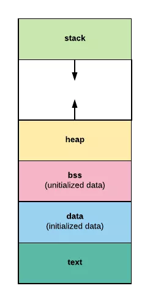
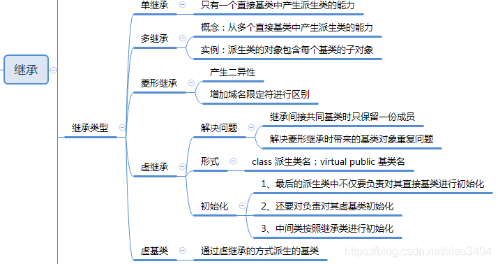
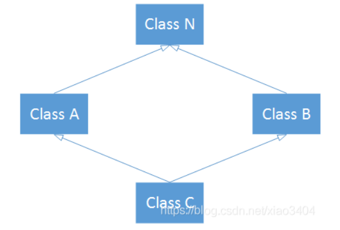

 [TOC]
## cpp 八股


### 智能指针

1. 智能指针的作用\为什么要使用智能指针

智能指针在本质上是一个类，它的作用是**管理一个指针**，程序员在为变量申请内存空间之后，如果在函数结束时或者变量超出其作用域时忘记释放内存，就会造成内存泄漏。而由于智能指针是一个类，所以当超出了类的作用域时，**就会调用析构函数**，自动释放资源。

1. 智能指针的种类
   1. `auto_ptr`: (已经被 C++11 废弃) 存在内存崩溃的风险，因为 `auto_ptr` 对象在复制时会将原来的指针置空。
   2. `unique_ptr`: 这一类智能指针保证同时只有一个智能指针可以指向该对象。当一个 `unique_ptr` 对象被销毁时，它所指向的对象也会被销毁。
   3. `shared_ptr`: 是一种可以共享的指针，允许多个指针指向同一个对象，当最后一个指向对象的 `shared_ptr` 被销毁时，它所指向的对象也会被销毁。使用 `use_count()` 函数可以查看有多少个 `shared_ptr` 指向同一个对象。
   4. `weak_ptr`：这类指针不控制对象的生命周期，它指向一个 `shared_ptr` 管理的对象，只作访问用，不会是指向该对象的指针计数变化。它可以用来协助 `shared_ptr` 工作，解决**循环引用（相互引用时的死锁)** 问题：两个共享指针相互引用，然后他们的计数就一直不可能是 0，资源永远也不会释放，解决办法就是其中一个指针使用 `weak_ptr`。

---

### c++ 内存

1. 内存分区是什么样的



从低地址到高地址分别是：代码区、常量存储区、全局\静态存储区、堆、栈。

1. 堆和栈的区别
   1. 管理方式不同，栈由编译器管理，而堆由程序员自行进行内存的管理和分配。
   2. 空间大小不同，堆的空间一般比较大，而栈的空间比较小。
   3. 地址增长方向不同，栈是一个先入后出的结构，所以地址从高地址向低地址增长，而堆是从低地址向高地址增长。
   4. 分配方式不同，栈既可以分配静态内存，也可以分配动态内存，而堆只能分配动态内存。
   5. 栈的存放是连续的，而堆由于存在很多 new 和 delete 的操作，所以存放的是不连续的。因此栈的分配效率比较高，而堆的分配效率较低。

### 指针参数传递和引用参数传递

指针参数传递实质上是一种值传递，被调用的函数会在栈中开辟一个空间用于存放传进来的这些参数的一个复制，所以在函数内部对这些参数的修改不会影响到原来的参数。但是由于指针参数传递传递的是一个地址，所以在函数内部对这个地址所指向的内容进行修改，就会影响到原来的参数。引用传递也会在栈中开辟一个空间，但是存储的传进来的实参的地址，所以在修改引用参数时，函数外对应的实参也会被修改。

### const 和 static

**static：修改变量的作用范围和可见性。**

1. 修饰局部变量：一般的变量在对应的代码块结束之后就会被销毁，但是如果在变量前加上 `static` 关键字，那么这个变量就会在执行程序的时间内一直都存在。
2. 修饰全局变量：限制全局变量的作用域，使得只能在当前文件中使用。一般的全局变量可以跨文件使用。
3. 修饰函数：限制函数的作用域，使得只能在当前文件中使用。一般的函数可以跨文件使用。
4. 修饰类：修饰成员函数，表示所有的类的实例共有这个函数，并且不能使用 this 指针。如果修饰成员变量，则表示所有实例共有这个变量，并且这个变量必需为 const 类型。
5. 修饰函数内的变量：表示这个变量只会初始化一次，不会因为函数的多次调用而重新初始化。

**const：修饰变量，表示这个变量的值不能被修改。**

1. 修饰基本数据类型，表示这个变量的值不能被修改。
2. 修饰函数参数，起到保护作用。
3. 在类中，const 修饰成员函数，表示这个函数不会修改类的成员变量。如果用 const 定义一个常量对象，那么这个对象只能调用 const 成员函数。非常量的对象可以调用 const 成员函数和非 const 成员函数。

### c++ 相比于 c，有什么区别？

基本语句上面没有太大的区别；

c 语言是一门面向过程的语言，重点是算法和数据结构，而 c++ 是一门面向对象的语言，重点是类和对象；

c++ 增加了一些语法和关键字；

在函数方面，c++ 中有重载和虚函数， c 语言中没有；

c++ 中增加了模板和重用代码，提供了 STL 标准库；

### c++ 和 java 的区别

1. **指针**：c++ 中我们可以直接使用指针来访问内存，但是在 java 中，没有办法直接访问内存，但是 java 也有指针，只是在虚拟机内部使用，不允许程序员直接访问。
2. c++ 支持**多重继承**，而 java 不支持多重继承。
3. java 是完全面向对象的语言，c++ 是半面向对象的语言。
4. 在内存管理上，java **自动进行垃圾回收**，但是堆内存的分配和回收是由程序员自己控制的。
5. **操作符重载**是 c++ 的特性，java 不支持操作符重载。

### c++ 怎么定义常量，放在内存的哪个位置；

局部变量放在栈区，全局常量在编译期一般不分配内存，而是放在符号表中提高访问效率，字面值常量比如字符串放在常量区。

### 重载、重写、重定义的区别

1. 重载：在一个作用域中，可以同时声明多个**名称相同，但是函数的参数列表一定不同，返回值可以相同**的函数，当调用这些个函数的时候，编译器会根据参数的个数、类型、顺序来选择调用对应的函数。
2. 重写：重写是类的继承中的一个概念，父类定义了一个虚函数，子类可以重写这个虚函数，重写的函数和父类中的这个函数除了函数体外完全相同，这样子类的对象在使用这个函数的时候，就调用的子类的函数。如果想访问父类的这个函数，就需要指定为父类的作用域。
3. 重定义：也叫做**隐藏**，是指我在派生类中重新定义了一个和基类中名称相同但是不是虚函数的函数，这样的话，在派生类中，就会隐藏基类中的这个函数，如果想访问基类中的这个函数，就需要指定为基类的作用域。

### c++ 中所有的构造函数

1. 默认构造函数：c++ 编译器自动生成一个构造函数，没有参数。
2. 重载的构造函数：对构造函数进行重载，可以有多个构造函数，只要参数列表不同即可。
3. 拷贝构造函数：用一个对象初始化另一个对象，它传入的参数是一个**对象的引用**，利用这个引用来初始化新的对象。
4. 类型转换构造函数：把其他类型转换为当前类型，对于类的构造函数来说，就是把其他类型转换为当前类的对象。

```cpp
#include <iostream>
using namespace std;
// 复数类
class Complex{
public:
   // 一般的构造函数
   Complex() : m_real(0), m_imag(0) {}
   // 带参数
   Complex(double real, double imag) : m_real(real), m_imag(imag) {}
   // 类型转换构造函数
   Complex(int a) : m_real(a), m_imag(0) {}

   double m_real, m_imag; // 实部和虚部
};

int main(){
   Complex c1; // 调用默认构造函数
   Complex c2(1, 2); // 调用带参数的构造函数
   Complex c3 = 3; // 调用类型转换构造函数
   cout << "c1: " << c1.m_real << " + " << c1.m_imag << "i" << endl;
   cout << "c2: " << c2.m_real << " + " << c2.m_imag << "i" << endl;
   cout << "c3: " << c3.m_real << " + " << c3.m_imag << "i" << endl;
   return 0;
}
```

### c++ 的四种强制类型转换

c 中有两种类型转换，显式和隐式。

显式转换：`int a = (float)b`;

隐式转换：`int a = 2.3;` 直接把 2.3 截断了。

c++ 兼容这两种类型转换，c++ 本身有四个强制类型转换的关键字：

- `static_cast`：`static_cast<type-id>(expression)` 将 expression 类型转换为 type-id 类型，但是没有动态类型检查，所以不安全。使用：
  - 类中基类和派生类之间指针和引用的转换
    - 派生类指针（引用）-> 基类指针(引用)：安全
    - 基类指针(引用)-> 派生类指针（引用）：不安全
  - 基本数据类型之间的转换：int char double 等
  - 把空指针转换为目标类型的指针
  - 把任何类型的表达式转换成 void 类型

**static_cast 不能转换掉 expression 的 const、volitale、__ unaligned。**

- `const_cast`:用于常量的强制类型转换，用于给变量加上 const 或者去掉 const 性质。但是 type-id 必须是引用或者指针，C++ 提供的一种修改 const 变量的方式，但是感觉没什么用。**唯一可以操作常量的指针。**
- `reinterpret_cast`

  - 改变指针或引用的类型
  - 将指针或者引用转换为一个足够长度的整形
  - 将整形转换为指针或者引用
    type-id 必须是一个指针、引用、算术类型、函数针或者成员指针。不到万不得已，不要使用这个转换符，高危操作。使用特点： 从底层对数据进行重新解释，依赖具体的平台，可移植性差；
- `dynamic_cast`

  - 它的特点是，上面的三种指针的强制 `类型转` 换都是在编译的时候就完成了，但是 dynamic_cast 的强制类型转换是在运行的时候进行的，并且还会进行类型检查，判断转换是否合理。
  - 不能用于内置的基本数据类型的强制转换
  - type-id 必需为指针或者引用，dynamic_cast 转换如果成功的话返回的是指向类的指针或引用，转换失败的话则会返回 nullptr
  - 主要对比和 static_cast 的区别，在进行上行转换的时候，两个没什么区别，但是进行下行转换的时候，dynamic_cast 会进行类型检查，更加安全。
  - **使用 dynamic_cast 进行转换的，基类中一定要有虚函数，否则编译不通过，****类中存在虚函数，就说明它有想要让基类指针或引用指向派生类对象的情况，此时转换才有意义，因为这是由于运行时类型检查需要****运行时类型信息****，而这个信息存储在类的****虚函数表中****，只有定义了虚函数的类才有虚函数表**

### 指针和引用的区别

1. 首先，二者在本质上是有区别的，指针实际上就是一个存储变量地址的变量，它本身可以改变，它所指向的地址中存放的数据也可以改变，在逻辑上指针是独立的。而引用只是原本变量的一个别名，在逻辑上不是独立的。所以在声明一个指针的时候可以不初始化，但是声明一个引用的时候必须初始化。
2. 引用比较安全，指针比较危险。
3. 在作为函数的参数的时候，指针传递的本质实际上是值传递，被调用函数的形式参数是作为被调函数的局部变量处理的，会在栈中开辟空间用来存放主函数传递进来的实参的值，从而形成实参的一个副本，引用传递也在栈中开辟了空间，但是存放的是传进来实参的地址，所以任何对形参的操作都会直接影响主函数中的实参。
4. 在编译时，指针和引用都会加入到符号表中，但是指针在符号表上记录的地址值是指针本身的地址，而引用变量记录的是引用对象的地址，符号表生成之后就不再改变了，所以说指针可以改变其指向的对象，但是引用就不能改变引用的对象。
5. 所以也可以得到 sizeof 引用得到的是所指向变量的大小，sizeof 指针得到的是指针本身的大小
6. 也可以得到引用自增是自增所指向的变量，指针自增是自增指针本身，即地址增加指针类型大小的字节数。
7. 存在多级指针，但是不存在多级引用
8. 引用没有 const，指针有 const 属性

### 野指针和悬空指针

- 野指针是指没有初始化的指针，它既不指向一块合法的内存， 也不为空，初始化！！！！
- 悬空指针是指指针原本指向一个合法的内存，但是内存空间被释放或者不再有效

  - 内存空间 free 后，指针悬空
  - 超出作用域，对应变量空间被释放，指针悬空

### const 修饰指针的几种情况

**右边最靠近 const 的即为被声明为常量的部分**

- `const int* p`:p 指向的整数常量的值不能修改
- `int* const p;` 指向整型变量的常量指针，指针不能再指向别的变量了
- `const int* const p`

### 函数指针

定义方式：`data_types (*func_pointer)( data_types arg1, data_types arg2, ...,data_types argn);`

举例：`int (*fp) (int, int);`

函数指针是一个指向函数的指针，指向函数入口的地址，可以通过函数指针来调用对应的函数。

同时有了函数指针的存在就可以使得函数作为参数传入，比如回调函数。

**通过函数指针可以实现函数的回调**

```cpp
_//  函数作为参数_
_void_ compareNumberFunction(_int_ _*numberArray_, _int_ _count_, _int_ _compareNumber_, _bool_ (*_p_)(_int_, _int_)) {
   for(_int_ i = 0; i < _count_; i++){
      if(_p_(*(_numberArray_ + i), _compareNumber_)){
         cout << (*(_numberArray_ + i)) <<'\t';
      }
   }
}

_bool_ compareLess(_int_ _a_, _int_ _b_){
   return _a_ < _b_;
}

_bool_ compareGreater(_int_ _a_, _int_ _b_){
   return _a_ > _b_;
}

_int_ main(){
   _int_ num[10];
   for(_int_ i = 0; i < 10; i++){
      num[i] = i;
   }
_   // 还可以使用lambda表达式_
   compareNumberFunction(num, 10, 3, [](_int_ _x_, _int_ _y_){return _x_ < _y_ ? true : false;});
   compareNumberFunction(num, 10, 7, compareGreater);
}
```

**函数指针还可以作为函数的返回值**

定义方式：

`int (*AFunction(char *ch,int (*p)(int,int)))(int, int);`

### 堆和栈

|              | 堆                                                                                                                                                                                                                                                                         | 栈                                                                                                                                                                                                 |
| ------------ | -------------------------------------------------------------------------------------------------------------------------------------------------------------------------------------------------------------------------------------------------------------------------- | -------------------------------------------------------------------------------------------------------------------------------------------------------------------------------------------------- |
| 管理方式     | 由程序员管理：malloc/free、new/delete                                                                                                                                                                                                                                      | 由编译器管理                                                                                                                                                                                       |
| 内存管理机制 | 系统有一个记录空闲内存地址的链表，当系统收到程序分配内存的申请时，就会遍历这个链表，找到第一个空间大于所需空间的内存块，然后将这个内存块从链表中删除，并将这个内存块的首地址返回给程序。当程序释放内存时，系统将释放的内存块加入到空闲内存链表中，以便下次分配内存时使用。 | 只要栈的剩余空间大于所申请空间，系统就会为程序提供内存，否则会报异常提示栈溢出。                                                                                                                   |
| 碎片问题     | 由于频繁的 new/delete 会造成内存空间的不连续，从而造成大量的碎片，使程序效率降低。                                                                                                                                                                                         | 栈是一个先进后出的数据结构，进出一一对应，不会产生碎片问题                                                                                                                                         |
| 空间大小     | 堆的空间比栈大得多，但堆是不连续的内存区域，32bit 系统下堆内存可以达到 4GB                                                                                                                                                                                                 | 栈的空间有限，是一块连续的内存区域，通常在 Windows 下是 2M，Linux 下是 8M                                                                                                                          |
| 生长方向     | 堆是向上生长的，即向着内存地址增加的方向                                                                                                                                                                                                                                   | 栈是向下生长的，即向着内存地址减小的方向                                                                                                                                                           |
| 分配方式     | 堆是动态分配的，没有静态分配的堆                                                                                                                                                                                                                                           | 栈有两种分配方式：静态分配和动态分配。静态分配是编译器完成的，比如局部变量的分配。动态分配由 alloca 函数进行分配，但是栈的动态分配和堆是不同的，他的动态分配是由编译器进行释放，无需我们手工实现。 |
| 分配效率     | 堆的分配效率比栈要低得多                                                                                                                                                                                                                                                   | 栈是机器系统提供的数据结构，计算机在底层对栈提供支持，分配专门的寄存器存放栈的地址，压栈出栈都有专门的指令执行，性能高效。                                                                         |

### new/delete   malloc/free 区别

#### malloc 和 new 的用法解释

- malloc：`void malloc(long NumBytes)`，c++ 中包括在头文件 `cstdlib` 中
  malloc 从堆中获取 NumBytes 字节大小的空间，如果申请成功返回指向这块内存的指针，指针类型为 void*，失败返回 NULL。
  **内存扩张**
  malloc 分配内存之后，不够用，可以通过 realloc 来扩张内存，如果当前内存的后面有足够空间，直接往后扩内存，返回原来的地址指针，如果不够，就重新找一块足够大小的内存空间，返回新的内存空间的地址。
- new+delete

  1. 调用 operator new 函数为对象在自由存储区分配内存
  2. 如果成功分配内存，则调用对象的构造函数
  3. 调用指针所指向对象的析构函数
  4. 调用 operator delete 函数释放内存
     `operator new` 和 `operator delete` 是系统提供的全局函数，**new 在底层调用 operator new 全局函数来申请空间**，**delete 在底层通过 operator delete 全局函数来释放空间。 **operator new 是通过 malloc 来实现的，operator delete 是通过 free 来实现的。
- 区别

1. **new 和 delete 是关键字，malloc 和 free 是库函数，需要对应的头文件**
2. new 分配的内存空间是在自由存储区，malloc 申请内存在堆空间。

**自由存储区**

插播自由存储区的解释，自由存储区是 C++ 中动态分配和释放对象的一个概念，**通过 new 分配，通过 delete 归还的内存区域成为自由存储区。自由存储区可以是堆，可以是全局/静态存储区，具体看 new 的实现，****但是基本上使用堆来实现自由存储**** ****。**

1. 返回类型有区别，new 分配成功返回对应的对象类型的指针，指向内存首地址，而 malloc 分配成功返回 void*类型指针，需要进行指针的强制类型转换，不是那么安全。malloc 分配失败返回 NULL，new 分配失败抛出 `bac_alloc` 异常。
2. 使用 new 的时候不用指定内存块的大小，会自动根据 new 的对象进行内存大小计算，而使用 malloc 的时候要显式的指定需要内存的大小。
3. malloc 申请的空间不会进行数据初始化，而 new 申请空间会进行数据初始化。
4. 申请自定义类型对象时，malloc/free 只会开辟空间，不会调用构造函数与析构函数，而 new 在申请空间后会调用构造函数完成对象的初始化，delete 在释放空间前后会调用析构函数完成空间中资源的清理

### malloc  calloc 和 realloc

`void *malloc(unsigned int num_bytes)；` 申请后不会对空间进行初始化

`void* calloc(size_t n, size_t size);` 申请后对空间进行初始化，比如申请 20 个 int 大小的空间：`int *p = (int*)calloc(20, sizeof(int))` 省去人为计算空间大小的麻烦，而且 **calloc 会对空间进行初始化，初始化为 0**

`void realloc(void *ptr, size_t new_Size)` 这是一个扩容函数，上面解释过

### volatile 和 extern

- volatile

1. volatile 关键字的作用是告诉编译器这个变量可能会被意想不到的改变。
2. 这样编译器不会自作主张去优化这个变量，优化器在每次遇到这个变量的时候，都会从内存中重新读取这个变量的值，而不是直接从寄存器中取得这个值。
3. 为了提高程序的执行效率，cpu 会对指令进行重排序，但是有些指令之间是有依赖关系的，不能随意重排序，这时候就需要用到 volatile 关键字，来告诉编译器不要对这个变量进行重排序。

- extern

用来修饰变量或者函数，表面**其定义出现在别的地方，此处是一个引用。有以下几种用法：**

1. 修饰变量和函数：表面在别的文件中已经有定义了。
2. 链接指定：用于在 C++ 文件中调用 C 方式编译的函数，告诉链接器在链接的时候用 C 函数规范来链接。

### define 和 const

1. define 在预编译阶段起作用，而 const 在编译、运行阶段起作用
2. define 的时候不带类型，没有类型检查，const 定义的时候带类型，有类型检查。因为 define 只是做简单的字符串替换，所以可能出现**边界效应** ，举例：

```cpp
#define N 2+3 //我们预想的N值是5，我们这样使用N
double a = N/2;  //我们预想的a的值是2.5，可实际上a的值是3.0
```

1. define 占用的是代码段的空间，而 const 定义变量与普通变量一样占用数据段。

### 虚函数的底层实现

虚函数表 + 虚表指针

- 虚函数表(vtable)

每个使用虚函数的类都**各自**维护一个虚函数表 vtable，vtable 是一个指针数组，包含指向类虚函数的指针。

基类和派生类的虚函数表的地址一定不同，但是虚函数表中虚函数的地址可能相同。

- 虚指针(vptr)

指向类虚函数。其实就是一个地址，所以大小也是指针的大小，32 位 4 个字节 64 位 8 个字节

- 使用虚函数后

1. **多了一个指向虚函数表的指针，所以类大小会增加 4 或 8。**

```cpp
class Base {

public:

int a;

virtual void f() { cout << "Base::f" << endl; }

virtual void g() { cout << "Base::g" << endl; }

virtual void h() { cout << "Base::h" << endl; }
};
//64位下sizeof(Base)的大小为16
```

1. 每个类编译器都创建一个虚函数地址表。
2. 使用指向对象的引用或指针调用虚函数，程序**会根据对象类型来调用虚函数，而不是指针类型**

### 如何计算类的大小

#### 结构体对齐规则

1. 结构体([struct](https://so.csdn.net/so/search?q=struct&spm=1001.2101.3001.7020))的数据成员,**第一个数据成员**存放的地址为**结构体变量偏移量为 0** 的地址处
2. **某数据类型存放的地址可以被该数据类型大小整除，**比如 int 型需放在地址为 4 的倍数的位置，char 型占一个字节可以放在任何位置。
3. 最后一个成员占用内存计算时**视为所有成员中占用内存最大的数据类型**
4. 结构体中嵌套结构体时，子结构体的起始地址**根据子结构体中最大的数据类型对齐**
5. 数组成员只看数组中元素类型来对齐，如 int a[16]按照 16 个 int 对齐。

#### 为什么要进行结构体内存对齐

1. 有利于提高 cpu 的访问速度。cpu 不是一个字节一个字节看待内存的，而是把内存当作一块一块的，一块的大小可能是 2、4、8、16 个字节，内存对齐就方便 cpu 读取数据，提高 cpu 的访问速度。
2. 有利于平台移植。并不是所有的平台都可以访问任意地址上的任意数据，所以如果把所有数据紧挨着存放，在有些平台上面可能数据就没有办法访问了，所有进行结构体内存对齐有利于进行平台的移植。

**影响对齐的情况**

`__attribute__((packed))` 取消变量对齐，所有变量紧挨着存储

`#pragma pack (n)`：让变量强制按照 n 的倍数进行对齐

#### 计算类的大小

1. 遵循结构体对齐规则
2. 类大小只计算普通数据成员，不计算静态成员和成员函数。
3. 空类大小为 1。如果一个类包含一个空类，则空类大小为 1。
4. 继承时的大小计算

- 注意空类作为基类被继承时，如果派生类有自己的数据成员，空类的 1 个字节不会被计算进去。

```cpp
class Empty {};
class D : public Empty { int a;};
//64位下D的大小为4
```

- 单继承时，如果派生类对基类的虚函数进行覆盖或者拥有自己的虚函数，则存在一个虚函数表指针，计算一个大小。
- 多重继承下，派生类有多个 vptr 指针，vprt 指针的顺序跟继承的顺序一致。就是说一个一个来，先继承一个，然后继承第二个。

```cpp
_// this is a empty class_
_class_ Base1{};
_class_ Base2{
_public:_
   _virtual_ _void_ funA(){cout << "this is base2:: funA" << endl;}
   _virtual_ _void_ funB(){cout << "this is base2:: funB" << endl;}
};
_class_ Base3{
_public:_
   _virtual_ _void_ funA(){cout << "this is base3:: funA" << endl;}
};

_class_ D : _public_ Base1, _public_ Base2, _public_ Base3{
_public:_
   _int_ a;
   _void_ funA(){cout << "this is D:: funA" << endl;}
   _void_ _virtual_ funB1(){cout << "this is D:: funB" << endl;}
};
//继承第一个，没有虚函数， +0
//继承第二个，+8
//继承第三个，+8
// int:+8    总共24

_int_ main(){
   D d;
   cout << "sizeof(Base1): " << sizeof(Base1) << endl;
   cout << "sizeof(Base2): " << sizeof(Base2) << endl;
   cout << "sizeof(Base3): " << sizeof(Base3) << endl;
   cout << "sizeof(D): " << sizeof(D) << endl;
_   // 输出结果： sizeof(Base1): 1 sizeof(Base2): 8 _
   //           _sizeof(Base3): 8 sizeof(D):     24_
}
```

### c++ 面向对象的三大特征：封装、继承和多态



#### 封装

将属性和一些方法打包在一个类中，对外隐藏实现细节，只向外提供使用的接口。

外界并不关心方法的具体实现细节，只需要根据提供的接口来调用对应的方法即可，因此使用起来更方便；

其次就是，通过封装，可以提高安全性，把一些类和方法设置为私有或者受保护的类型，只让内部调用或者让受信任的对象调用，更安全。防止外界程序错误使用或者意外修改数据。

还有就是维护起来更方便，后期维护的时候我们只要修改类的内部这个方法的实现细节即可，只要接口不变，外部的代码就不需要做任何修改。

#### 继承

##### 什么是继承？

继承允许我们通过一个类来定义另外一个类，被继承的类叫做基类或者父类，继承的那个类叫做子类或者派生类，子类可以从父类那里继承除了构造函数和析构函数以外所有的数据成员，而不用重新编程这些属性方法，从而提高了代码的复用性，有利于结构化编程。并且子类可以在此基础上扩展新的属性和方法。

##### 派生类对象的构造和析构过程

1. 调用基类的构造函数，初始化从基类中继承的成员
2. 调用派生类自己的构造函数，初始化自己的成员
3. 派生类对象超出作用域
4. 调用派生类自己的析构函数，释放自己的成员可能占用的资源
5. 调用基类的析构函数，释放从基类继承的成员可能占用的资源

##### 继承（泛化）和组合（聚合）

继承和组合都是面向对象中代码复用的方式，继承强调的是 A 是 B 的关系，比如小轿车是汽车的一种，而组合强调的是整体和局部的关系，比如眼睛是五官的一部分。在继承中，子类对父类的实现细节是可见的，属于白盒式复用，而组合中，各个对象的内部细节是相互不可见的，属于黑盒式复用。继承在编码过程中就要指定父类，这个关系在编译期就确定了，而组合关系一般在运行的时候确定。

**优点和缺点**

**一般来说，组合是优于继承的。**

继承的缺点：

- 代码白盒复用，父类的实现细节暴露给了子类，破坏了封装
- 父类代码修改，子类代码也要跟着修改，因为子类依赖于父类，缺乏独立性
- 不支持动态扩展，在编译器继承关系就决定了

组合的优点：

- 代码黑盒复用，各个对象之间不会相互暴露具体实现细节
- 整体类与局部类之间松耦合，相互独立，我需要修改哪一部分就修改哪一部分，不对其他部分造成影响
- 支持动态扩展，在运行时根据具体对象选择不同类型的组合对象

组合的缺点：因为由多个局部类组合成为整体类，需要创建的对象比较多。

##### 实现继承和接口继承

- **纯虚函数**只提供接口继承，可以被子类实现
- **虚函数**既提供接口继承，也提供了一份默认的实现，即同时提供了接口继承和实现继承，子类可以直接用也可以**重写**这个虚函数
- 普通函数既提供接口继承，也提供实现继承，如果在子类中**重定义**这个函数（函数名相同即可，参数列表可以不同），则子类就会把父类中的同名方法隐藏。

##### 抽象类和接口类

抽象类是**包含至少一个纯虚函数的类，不能被实例化，只能被继承**

**纯虚函数**是在基类中只提供了声明，但是没有具体实现的函数，定义方式 `virtual`` ``void`` ``pureVirtualFunction``()`` ``=`` ``0``;`

接口类是一种特殊的抽象类，**只包含纯虚函数**

##### 菱形继承和虚继承

- **菱形继承的问题**
  - 多继承的二义性：多个基类中存在同名成员，派生类不知道是哪一个，用域运算符标明
  - 菱形继承
    

菱形继承的问题：

- 虚继承用于解决菱形继承中的问题

**虚基类**用于解决菱形继承问题，它的作用就是在**间接继承共同基类时只保留一份基类成员**，虚基类是在派生类定义的时候声明的，声明方式如下：

用了虚基类，N 就只有一份，**因此引用的时候就不需要域运算符了。**

```cpp
class A{...};
//此处声明虚基类
class B : virtual public A{...};
```

1. 虚基类的初始化

由最后的派生类负责虚基类的初始化，比如在菱形继承中，由 C 负责虚基类 N 的初始化

1. 虚基类的构造

最后的派生类对基类的构造函数调用，而忽略其他派生类对虚基类的构造函数调用。从而避免对基类数据成员重复初始化。**因此，虚基类只会构造一次。**

#### 多态

- 什么是多态

多态就是**不同对象对于同一行为会有不同的状态，**当基类**定义了虚函数**的时候，派生类可以对基类的虚函数进行重写，以设置不同的状态，这样在使用指向子类对象的父类指针的时候，就可以调用子类的成员函数。

因此多态有两个必要条件：1. 虚函数重写  2. 使用指针或引用调用虚函数

**多态和非多态的本质区别就是** 非多态是静态绑定，也就是在编译阶段就确定程序的行为，而多态是动态绑定，实在程序允许时，根据具体的对象确定程序行为。也就是说非多态的函数调用在编译的时候就确定函数地址了，而多态的函数调用是在程序运行起来后，根据虚函数表来找实际上应该调用的函数。

- 多态的原理

多态是用虚函数表实现的，上面已经解释过虚函数的原理。

### override 和 final

override 和 final 是用来要求某些函数不能再被重写或者某些类不能再被继承

- final

1. final 修饰类，表明这个类不能再被其他类继承:`class A final{};`
2. final 修饰成员函数，表示这个函数不能再被重写 `virtual void func() final {}`

- override

提供额外的控制，在派生类中进行虚函数重写的时候，添加 override 关键词，如果基类中没有这个虚函数则会报错。

### 析构函数为什么一般写成虚函数

实现析构函数的多态，对不同的派生类调用对应的析构函数，从而降低内存泄漏的可能性。举例来说，一个父类的指针指向一个子类的对象，在销毁时，如果基类的析构函数不是虚函数，那么编译器会根据指针的类型来调用父类的析构函数，而只使用父类的析构函数是无法释放派生类的自身内容占用的资源的，就会造成内存泄漏。如果析构函数是虚函数，根据多态，在销毁的时候会先执行子类的析构函数，再执行父类的析构函数，释放所有占用的内存。

### 构造函数为什么不定义为虚函数

1. 虚函数的调用是通过实例化之后对象的虚函数表找到对应虚函数的地址进行调用的，如果构造函数是虚函数，在构造之前，虚函数表指针不存在啊，找不到对应的虚函数表来调用虚函数，前后矛盾了。
2. 虚函数的目的是为了实现多态，而每个类都应该有自己的构造函数，根据给定的所有信息来实例化对象，因此没有必要把构造函数设置为虚函数
3. 虚函数主要用于在信息不全的情况下，能使重写的函数得到相应的调用。而构造函数的作用是实例化一个类，是在创建对象的时候主动调用的，是需要知道对象的完整信息的，才能实现实例化。因此不会把构造函数设置为虚函数。

### 构造函数和析构函数的执行顺序

1. 全局变量在程序开始时调用构造函数，程序结束时调用析构函数
2. 静态变量在函数第一次被调用的时候调用构造函数，整个程序结束的时候调用析构函数
3. 局部变量在进入代码段时调用构造函数，代码段结束的时候调用析构函数

---

**基类、派生类和成员变量中的执行顺序**

1. 执行基类的构造函数
2. 执行基类成员变量的构造函数
3. 执行派生类的构造函数
4. **多继承的时候，多个父类的构造函数的调用顺序与派生类构造函数定义时冒号后面基类的出现顺序无关，而是按照定义派生类时继承的顺序进行调用构造函数。**

```cpp
class derive : public base1, public base2{
    derive() : base2(), base1(){}
}
//与第一行的继承顺序有关，与第二行构造函数的顺序无关
```

1. 析构函数的执行顺序和构造函数刚好相反

### 静态绑定（早期绑定）和动态绑定（后期绑定）

对象的静态类型：声明时候的类型，编译时就确定了，静态类型无法修改

对象的动态类型：目标所指向的对象，运行期间决定的，动态类型可以修改

**绑定** ：把一个名称（变量、函数）和对应的地址关联起来

**静态绑定在编译时绑定，动态绑定在程序运行时绑定，其核心思想是在运行的时候去决定一个对象的实际类型**

只有虚函数才有动态绑定，其他的都是静态绑定。

### 深拷贝和浅拷贝

深拷贝和浅拷贝是两种不同的对象复制方式，**浅拷贝**只复制对象的成员变量的值，但是不复制其所指向的资源，而**深拷贝**既复制对象的成员变量的值，同时还复制其指向的资源。我们使用等号进行类的赋值的时候，会调用类的默认的拷贝构造函数，这是一种浅拷贝。一般情况下二者没有区别，不会产生问题，但是当类中含有指针的时候，如果进行浅拷贝，那么两个类中的指针指向的是同一块内存，只复制了变量没有复制资源，当调用析构函数的时候，就会出现野指针的情况，这时候就要使用深拷贝，既拷贝变量又拷贝资源。

### 为什么拷贝构造函数的参数传递方式必须是引用传递

为了防止递归调用。当一个对象需要以值方式进行传递时，编译器会生成代码调用它的拷⻉构造函数生成一个副本，如果类 A 的拷⻉构造函数的参数不是引用传递，而是采用值传递，那么就又需要为了创建传递给拷⻉构造函数的参数的临时对象，而又一次调用类 A 的拷⻉构造函数，这就是一个无限递归

### 内存泄漏以及如何排查

申请了一块内存但是使用完毕之后没有释放，随着程序的运行，占用的内存越来越多，最终用完内存，导致系统崩溃。使用智能指针有利于减少内存泄漏。

### const、define、typedef、inline 的区别

1. const 和 define 的区别
   - const 定义的常量有数据类型，define 定义的常量没有数据类型
   - const 是在编译时处理的，有类型检查，define 是在预处理时处理的，没有类型检查
   - const 可以定义常量、常量指针、常量引用，define 只能定义常量
   - const 定义的常量在编译时分配内存，define 定义的常量在预处理时进行简单的替换，占用代码段空间
   - const 不能重定义，define 可以用#undef 取消定义
   - define 可以用来防止文件重复包含。

   ```cpp
   ```

#ifndef _TEST_H_  // 如果没有定义_TEST_H_
#define _TEST_H_  // 定义_TEST_H_
#endif  //

```

2. define和typedef的区别
	- define是宏定义，没有类型检查，typedef是类型定义，有类型检查
	- define是在预处理时处理的，typedef是在编译时处理的
	- typedef只能为类型定义别名，define可以定义常量、宏、函数等

3. define和inline的区别
	- inline是内联函数，有类型检查，define是宏定义，没有类型检查
	- inline是在编译时进行替换，define是在预处理时进行文本替换
	- inline比较安全，define容易出错


### c++程序的执行过程

### 预处理、编译、汇编、链接的过程

1. 预处理：预处理器处理以“#”开头的预处理命令，如#include、#define、#ifdef等，将宏定义、文件包含、条件编译等处理后生成一个.i文件

2. 编译：编译器将预处理后的.i文件编译成汇编代码，生成一个.s文件

3. 汇编：汇编器将汇编代码转换成机器码，生成一个.o文件

4. 链接：链接器将多个.o文件链接成一个可执行文件，生成一个.exe文件

#### 动态编译和静态编译

- 动态编译的可执行文件需要附带一个的动态链接库，在执行时，需要调用其对应动态链接库中的命令。所以其优点一方面是缩小了执行文件本身的体积，另一方面是加快了编译速度，节省了系统资源。缺点一是哪怕是很简单的程序，只用到了链接库中的一两条命令，也需要附带一个相对庞大的链接库；二是如果其他计算机上没有安装对应的运行库，则用动态编译的可执行文件就不能运行。

- 静态编译就是 编译器在编译可执行文件的时候，将可执行文件需要调用的对应动态链接库(.so)中的部分提取出来，链接到可执行文件中去，使可执行文件在运行的时候不依赖于动态链接库

#### 动态链接和静态链接

pass

```  

### 为什么map和set的底层实现为红黑树
因为红黑树是一种平衡二叉树，查找、插入、删除的时间复杂度都是O(logn)，效率比较高。而且红黑树是一种自平衡二叉查找树，可以保证在任何情况下，树的高度都是O(logn)。因此，红黑树是一种比较理想的数据结构，适合用来实现map和set。  

