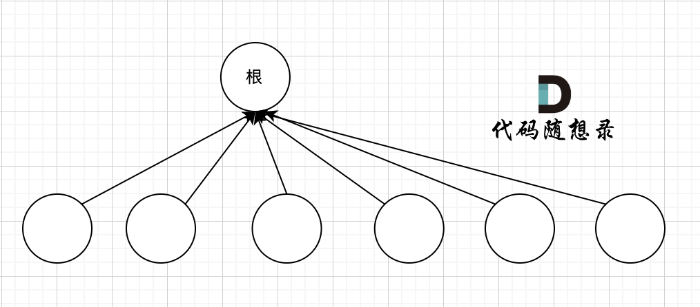

# dataStructure

## 树相关

### 二叉搜索树

定义：二叉搜索树是一棵二叉树，每一个节点的值都大于其左子树中任意一个节点的值，小于其右子树中任意一个节点的值。并且左右子树也是二叉搜索树。

### 平衡二叉树

定义：树中每一个节点的左右子树的高度差不超过 1。

### b 树、b+ 树、b*树

**内部节点**：除了叶子节点和根节点，其他节点都是内部节点。

**键**：节点存储的元素。

**度**：节点的子节点的个数。

#### b 树

##### 定义

b 树实际上是一种多叉搜索树，二叉搜索树的扩展，二叉搜索树根据节点的值将数据范围一分为二，而 b 树根据节点的值将数据范围一分为多。

**m 阶 b 树**，m 阶指的是每个节点最多有 m 个子节点，最多有 m-1 个关键字。m 阶 b 树的特点：

1. 根节点至少有两个子节点。
2. 每个节点至多有 m 个子节点，每个内部节点至少有个$\lceil m/2 \rceil$子节点。这个特点保证了每个块的使用率至少是 1/2。
3. 如果一个非叶子节点有 k（$k\leq m$)个子节点，那么它有 k-1 个关键字。
4. 所有叶子节点都在同一层。

#### b+ 树

b+ 树是 b 树的一种变体，b+ 树的特点：

1. 非叶子节点的子节点指针与关键字个数相同。
2. 非叶子节点的子节点指针 P[i]，指向关键字值属于[K[i],K[i+1])的子树。
3. 所有关键字都在叶子节点出现。
4. 叶子节点之间构成了一个有序链表。

#### b*树

b *树是 b+ 树的一种变体，b* 树在 b+ 树的基础上，对非叶子节点增加了指向兄弟右侧兄弟节点的指针。除此之外，b 树规定每个内部节点的子节点数必须在$\lceil m/2 \rceil$和 m 之间，而 b *树规定每个内部节点的子节点数必须在$\lceil 2m/3 \rceil$和 m 之间。从而保证了 b*树的每个节点块的使用率至少是 2/3。

#### 面试题

##### 为什么说 b+ 树比 b 树更适合做操作系统中的文件索引和数据库索引？

1. 文件和数据库都需要较大的存储空间，所以不可能存储在内存中，需要存储在磁盘中。而磁盘的读写速度远远慢于内存，所以需要减少磁盘的 I/O 次数。
2. b+ 树和 b 树相比，b+ 树的非叶子节点不存储数据，只存储索引，占用的空间更小，可以容纳更多的索引，减少了树的高度，减少了 I/O 次数。
3. b+ 树方便扫描数据库，因为所有的数据都在叶子节点，而且叶子节点之间构成了一个有序链表，方便扫描。
4. b+ 树的查询效率更稳定，因为所有的数据都在叶子节点，而 b 树的数据可能在非叶子节点，也可能在叶子节点，查询效率不稳定。

### 红黑树

红黑树是一种**自平衡二叉搜索树**  ，它保证了任何一个节点的左右子树的高度差小于两倍。

#### 为什么需要红黑树？

对于普通的二叉搜索树，如果数据是随机的，那么插入，删除，查找的时间复杂度都是 O(logn)。但是如果数据是有序的，那么二叉搜索树就会退化成链表，时间复杂度就会变成 O(n)。所以说二叉搜索树的插入，删除，查找的时间复杂度在 o(logn)到 O(n)之间。而红黑树就是为了解决这个问题而设计的，它可以解决二叉搜索树退化成链表的问题，使得插入，删除，查找的时间复杂度尽量稳定在 O(logn)。

#### 红黑树的性质

首先，红黑树是一个二叉搜索树，同时给每个节点增加了颜色属性，可以是红色或者黑色。

同时，红黑树还需要满足以下 5 个性质：

1. 每个节点要么是红色，要么是黑色。
2. 根节点是黑色。
3. 叶子节点都是黑色（这里的叶子节点指的是最底层的空节点，在下图中，那些 null 节点才是叶子节点）。
4. 红色节点的子节点都是黑色。
5. 从任一节点到其每个叶子的所有路径都包含相同数目的黑色节点。


#### 红黑树的操作效率

红黑树的插入，删除，查找的时间复杂度都是 O(logn)。

1. 查找：和平衡二叉搜索树一样，红黑树的查找时间复杂度也是 O(logn)。
2. 插入和删除：红黑树的插入和删除操作都是 O(logn)的时间复杂度。因为红黑树是一种自平衡二叉搜索树，插入和删除操作可能会破坏红黑树的性质，所以需要通过旋转和变色等操作来维护红黑树的性质。

#### 红黑树的等价变换

如图所示的红黑树


可以等价变换为一棵 4 阶的 B 树


因此有如下的结论：

1. 红黑树和 4 阶 B 树是等价的。
2. 黑节点和红节点融合在一起，形成一个 b 树节点
3. 红黑树的黑色节点数和 4 阶 b 树的总结点个数相等
4. 把 b 树节点看作一棵树，则黑色节点是父节点，红色节点是子节点，黑色在中间，红色在两边。

#### 红黑树的旋转操作（一般树也是这样）

- 左旋和右旋
  - 左旋：把当前节点变为其右孩子的左孩子，并不改变中序遍历顺序。
  - 右旋：把当前节点变为其左孩子的右孩子，并不改变中序遍历顺序。

**在二叉搜索树中，不改变中序遍历顺序=不改变二叉搜索树的性质**

#### 插入和删除

有点复杂，先 pass;

### 小根堆和大根堆

基本定义已经清楚，主要关注建立、向上调整、向下调整。

以小根堆的建立为例

1. 建立

从末尾开始逆序遍历数组的元素，对每个元素进行向下调整，每次选择左右孩子中较小的一个与父节点交换，直到叶子节点。注意向下调整的时候，交换完了之后还要判断两棵子树是否满足堆的性质，如果不满足，需要继续向下调整。

1. 向上调整

从当前节点开始，不断与父节点比较，如果当前节点比父节点小，就交换两个节点，直到根节点。

1. 向下调整

从当前节点开始，不断与左右孩子中较小的一个比较，如果当前节点比左右孩子中较小的一个大，就交换两个节点，直到叶子节点。优先和更小的孩子交换，这样可以保证交换后的子树仍然是小根堆。

1. 插入

把新加入的元素放在数组的末尾，然后向上调整。

1. 删除

根据堆的性质，只能从堆顶删除元素。因此删除方法为把最后一个元素复制到堆顶，然后向下调整，堆的大小减一。

## 并查集

并查集主要用于解决图的动态连通性问题，包括判断两个节点是否连通，合并两个连通分量等。

```cpp
class UnionFind {
    // 节点数量
    int n = 1005;
    // 一维数组表示节点的父节点
    vector<int> father(n, 0);
    // 初始化：所有节点的父节点都是自己
    void init() {
        for (int i = 0; i < n; i++) {
            father[i] = i;
        }
    }
    // 查找根节点
    int find(int x) {
        if (father[x] == x) {
            return x;
        }
        _// 注意这里写成father[x] = find(father[x])，是为了路径压缩_
        return father[x] = find(father[x]);
    }
    // 判断两个节点是否连通
    bool isConnected(int x, int y) {
        return find(x) == find(y);
    }
    // 将u->v这条边加入并查集
    // 这里注意：u和v是连通的，所以他们的根节点是一样的，但是这里不是直接将u的父节点指向v，而是将u的根节点指向v的根节点
    void join(int u, int v) {
        int fu = find(u);
        int fv = find(v);
        if (fu != fv) {
            father[fu] = fv;
        }
    }
};
```

并查集图示


路径压缩：用来减少 find 函数递归的次数


